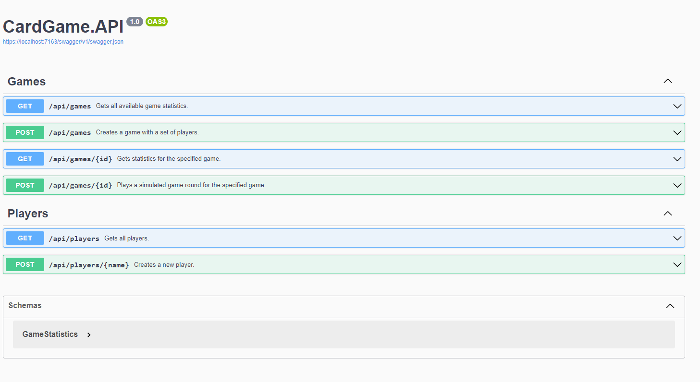

# CardGame

A simple ASP NET 6 API round based game where players draw cards until first player gets a matching card pair, e.g. two kings, two aces, etc.

The game connects to https://deckofcardsapi.com/ API service for serving cards.

Core features include:
1. New player creation.
2. Game creation with set of players.
3. A simple round simulation returning game statistics, e.g. if game has a winner and rounds played.

## Docker Image

To access the the latest docker image see GitHub Container Registry [here](https://github.com/ralphfe/CardGame/pkgs/container/cardgame).